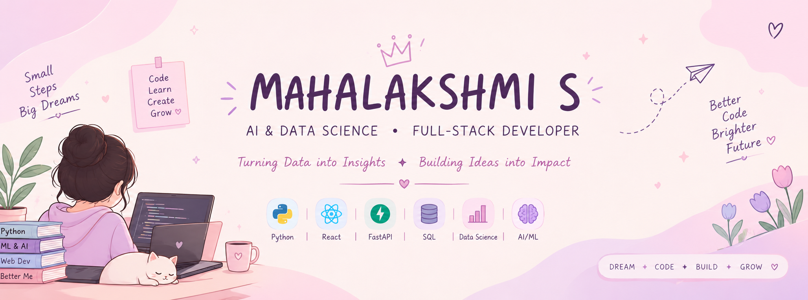

<div align="center">



<br>

<a href="https://git.io/typing-svg">

</a>

<br>


<br><br>

<a href="https://mahalakshmi-portfolio-9p4m.vercel.app/">

</a>

<a href="https://www.linkedin.com/in/mahalakshmi-s-7aa78b36b/">

</a>

<a href="mailto:mahalakshmi70867@gmail.com">

</a>

<a href="https://github.com/mahalakshmi2007-dot">

</a>

<br><br>


</div>

---

# 🌷 About Me

<div align="center">

## 🌷 Hello, I'm Mahalakshmi!

### `AI & Data Science Student` • `Full-Stack Developer` • `AI/ML Explorer`

**Turning ideas into useful applications with data, AI, and modern web technologies.** ✨

</div>

---

## 💗 About Me

Hi! I'm **Mahalakshmi S**, a B.Tech **Artificial Intelligence & Data Science** student from Tamil Nadu.

I'm interested in building practical applications that combine **AI/ML, data, backend development, and modern frontend technologies**.

I enjoy learning through hands-on projects and turning ideas into complete applications.

### 🌸 A little about my journey

* 🎓 B.Tech Artificial Intelligence & Data Science student
* 🤖 Interested in Artificial Intelligence & Machine Learning
* 📊 Interested in Data Analytics & Data Visualization
* 💻 Building Full-Stack applications
* 🐍 Working with Python and FastAPI
* ⚛️ Building interfaces with React
* 🗄️ Working with SQL and databases
* 🌱 Learning through hands-on projects

---

## 🛠️ Tech Stack

<div align="center">

### 💻 Languages


<br><br>

### 🌐 Frontend


<br><br>

### ⚙️ Backend & Database


<br><br>

### 📊 Data & AI


<br>

`Pandas` • `NumPy` • `Scikit-learn` • `Machine Learning` • `Data Analytics`

<br><br>

### 🔧 Tools


</div>

---

# 🌸 Featured Projects

## 💰 SpendWise AI

**AI-powered personal finance management and expense analysis application.**

SpendWise AI combines a web application with machine learning to help users manage expenses and understand spending patterns.

### 🧰 Tech Stack

`Python` `FastAPI` `React` `SQLite` `Scikit-learn`

### ✨ Key Features

* 💳 Expense tracking
* 🏷️ Automatic expense category prediction
* 💰 Budget monitoring
* 📈 Spending forecast
* 🚨 Anomaly detection
* 📊 Analytics dashboard

### 🧠 Machine Learning

* **TF-IDF + Logistic Regression** → Expense category prediction
* **Linear Regression** → Spending forecasting
* **Isolation Forest** → Anomaly detection

<br>

<a href="https://github.com/mahalakshmi2007-dot/spendwise-ai">

</a>

<a href="https://spendwise-ai-lake.vercel.app/">

</a>

---

## 🚚 MoveMate

**Smart relocation and budget planning application for students and working professionals moving to a new city.**

MoveMate focuses on helping users understand the affordability of relocating to another city.

### 🧰 Tech Stack

`React` `TypeScript` `Vite` `Tailwind CSS` `FastAPI` `Python` `SQLite`

### ✨ Key Features

* 🏙️ Relocation affordability analysis
* 💰 Cost-of-living comparison
* 📋 Moving-related financial planning
* 📊 Data-driven insights
* 🎨 Interactive user interface
* ⚡ FastAPI REST APIs

<br>

<a href="https://github.com/mahalakshmi2007-dot/movemate">

</a>

---

## 🧩 APART

A featured project from my GitHub projects.

### 🔗 Project

<a href="https://github.com/madhumitha-sunil/APART">

</a>

---

# 🌱 Currently Learning

<div align="center">

| 🌷 Area             | 🔎 Focus                       |
| ------------------- | ------------------------------ |
| 🐍 Python           | Data & application development |
| 📊 Data Analytics   | Analysis & visualization       |
| 🧠 Machine Learning | Practical ML applications      |
| ⚡ FastAPI           | Backend & REST APIs            |
| ⚛️ React            | Modern frontend development    |
| 🗄️ SQL             | Data management & analysis     |
| 📈 Statistics       | Data-driven decision making    |
| 🤖 AI               | AI-powered applications        |

</div>

---

# 🎯 What I'm Building Toward

```text
Learning
   ↓
AI • ML • DSA • Backend • System Design
   ↓
Building
   ↓
Full-Stack + AI Applications
   ↓
Exploring
   ↓
GenAI • LLMs • AI Agents
   ↓
Improving
   ↓
Software Engineering & Problem Solving
```

### 🌸 My Development Journey

```text
Data Analytics
      ↓
   Python
      ↓
Machine Learning
      ↓
   FastAPI
      ↓
    React
      ↓
  Database
      ↓
 Deployment
      ↓
🤖 AI Applications
```

My goal is to become a developer who can work across the complete application lifecycle — from **data and machine learning models to backend APIs, frontend interfaces, databases, and deployment**.

---

# 💌 Let's Connect

<div align="center">

<a href="https://github.com/mahalakshmi2007-dot">

</a>

<a href="https://www.linkedin.com/in/mahalakshmi-s-7aa78b36b/">

</a>

<a href="https://mahalakshmi-portfolio-9p4m.vercel.app/">

</a>

<a href="mailto:mahalakshmi70867@gmail.com">

</a>

</div>

---

<div align="center">

### 🌷 Learn • Build • Create • Grow 🌷

*Building my skills one project at a time.* ✨

<br>


</div>
